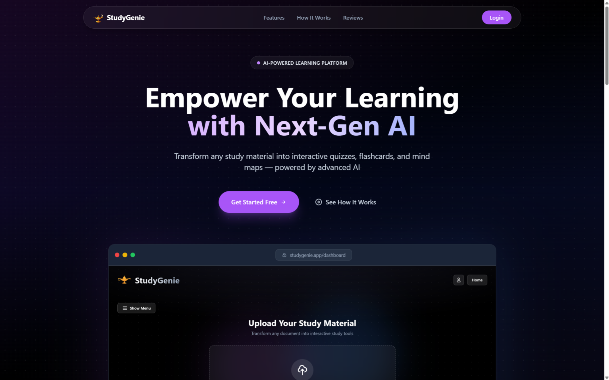

# 🧞 StudyGenie

**StudyGenie** is Next-Gen AI-Powered Learning Platform designed to transform how you study. By leveraging advanced AI models, StudyGenie instantly converts your study materials (PDFs, text files, images) into interactive learning tools like quizzes, flashcards, and mind maps.



## ✨ Features

### 🧠 Intelligent Study Tools
- **Smart Quizzes**: AI-generated multiple-choice questions with instant feedback and detailed explanations.
- **Flashcards**: Interactive learning cards to help memorize key concepts efficiently.
- **Mind Maps**: Visual knowledge graphs powered by ReactFlow to understand connections between topics.
- **AI Summaries**: Concise, bulleted summaries of long documents for quick review.

### 📄 Multi-Format Support
- **PDF Documents**: Upload and parse textbooks or lecture notes.
- **Images**: Extract text from images (OCR) for analysis.
- **Text Files**: Process raw text notes directly.

### 🎮 Gamified Learning
- **XP System**: Earn experience points for every quiz completed and material studied.
- **Leveling**: Level up your profile as you master more subjects.
- **Achievements**: Unlock badges for streaks, high scores, and mastery.
- **Profile Customization**: Personalize your user profile and track your journey.

### 📊 Analytics & History
- **Progress Tracking**: Visualize your quiz scores over time with Recharts.
- **History Log**: Review past quiz attempts and uploaded materials.
- **Local Persistence**: All data is stored locally in your browser for privacy and speed.

### 🎨 Modern UI/UX
- **Responsive Design**: Fully optimized for Desktop, Tablet, and Mobile devices.
- **Immersive Theme**: Sleek "Black Theme" with purple/indigo accents and dotted grid backgrounds.
- **Interactivity**: Smooth transitions, backdrop blurs, and glassmorphism effects.

---

## 🛠️ Tech Stack

- **Frontend Framework**: [React 18+](https://react.dev/) with TypeScript
- **Build Tool**: [Vite](https://vitejs.dev/)
- **Styling**: [Tailwind CSS](https://tailwindcss.com/)
- **AI Integration**: [OpenRouter API](https://openrouter.ai/) (supporting Google Gemini models)
- **Visualizations**: [Recharts](https://recharts.org/) (Charts), [ReactFlow](https://reactflow.dev/) (Mind Maps)
- **PDF Processing**: [pdfjs-dist](https://mozilla.github.io/pdf.js/)

---

## 🚀 Getting Started

Follow these steps to set up the project locally.

### Prerequisites
- Node.js (v16 or higher)
- npm or yarn

### Installation

1. **Clone the repository**
   ```bash
   git clone https://github.com/saurabh-rajput-15/study-genie.git
   cd study-genie
   ```

2. **Install dependencies**
   ```bash
   npm install
   ```

3. **Configure Environment Variables**
   Create a `.env` file in the root directory and add your OpenRouter API key:
   ```env
   VITE_OPENROUTER_API_KEY=your_openrouter_api_key_here
   ```
   > **Note**: This project uses OpenRouter to access models like Google Gemini. You can get a key at [openrouter.ai](https://openrouter.ai).

4. **Run the development server**
   ```bash
   npm run dev
   ```

5. Open your browser and navigate to `http://localhost:5173`.

---

## 📂 Project Structure

```
study-genie/
├── components/         # React UI components
│   ├── Dashboard.tsx   # Main user hub
│   ├── LandingPage.tsx # Hero section and feature showcase
│   ├── Sidebar.tsx     # Navigation and upload history
│   ├── QuizView.tsx    # Interactive quiz interface
│   └── ...
├── hooks/              # Custom React hooks (e.g., useGamification)
├── services/           # External services and API logic
│   ├── geminiService.ts   # AI content generation logic
│   ├── fileProcessorService.ts # File parsing (PDF/Image)
│   └── historyService.ts  # LocalStorage data management
├── public/             # Static assets
└── types.ts            # TypeScript definitions
```

## 🔒 Privacy & Data

StudyGenie operates on a **Local-First** architecture. 
- Your uploaded files are processed in-memory.
- Your study history, XP, and profile stats are stored in your browser's `localStorage`.
- AI analysis requires sending data to the OpenRouter/Gemini API, but no personal data is persistently stored on our servers.

## 🤝 Contributing

Contributions are welcome! Please feel free to submit a Pull Request.

1. Fork the project
2. Create your feature branch (`git checkout -b feature/AmazingFeature`)
3. Commit your changes (`git commit -m 'Add some AmazingFeature'`)
4. Push to the branch (`git push origin feature/AmazingFeature`)
5. Open a Pull Request

## 📄 License

This project is licensed under the MIT License - see the [LICENSE](LICENSE) file for details.